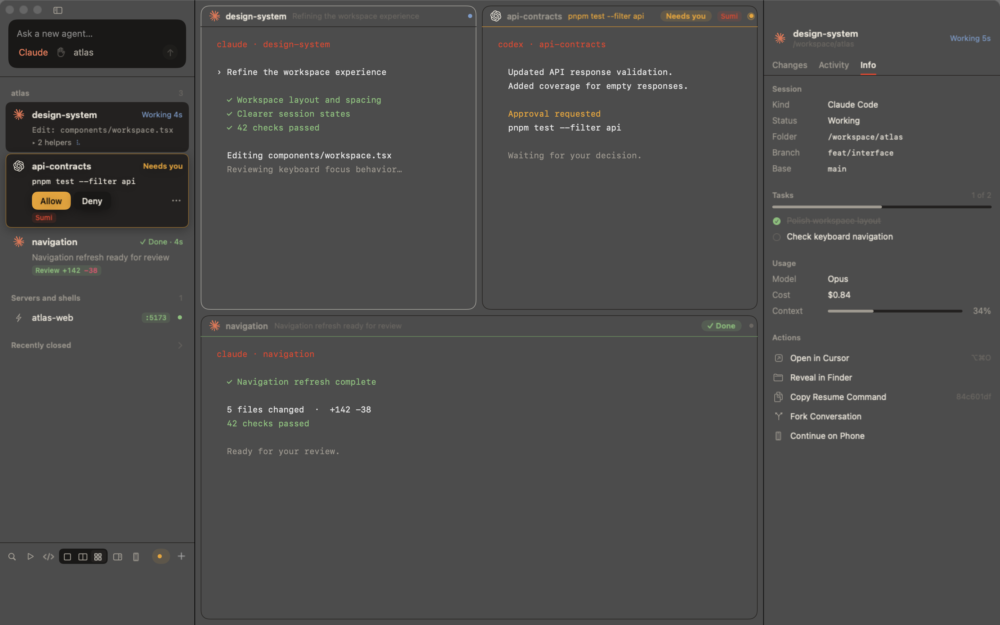
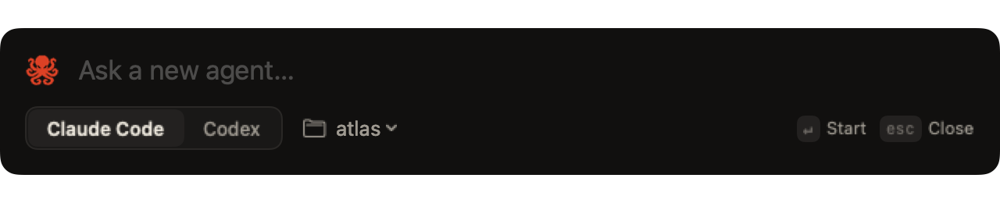

<p align="center">
  
</p>

<h1 align="center">Tako</h1>

<p align="center">
  <b>A terminal for running many coding agents at once.</b><br>
  Tako runs Claude Code and Codex side by side in real terminals, and keeps track of them for you:<br>
  which one needs an answer, which one is done, and what each one changed.<br>
  <b>Sumi</b>, an agent of its own, runs the rest for you, even from your phone, and a <b>steward</b> keeps your Mac fast while they work.
</p>

<p align="center">
  <a href="https://nikshepsvn.com/tako/">Website</a> ·
  <a href="#install">Install</a> ·
  <a href="#why-tako">Why</a> ·
  <a href="#sumi-and-the-steward">Sumi &amp; Steward</a> ·
  <a href="#how-it-compares">Compare</a> ·
  <a href="#everything-it-does">Features</a>
</p>

<p align="center">
  
  
  
  
  <a href="LICENSE"></a>
</p>

<p align="center">
  
</p>

> **蛸 (tako)**: *octopus*. Eight arms, many agents, one calm head. (Formerly Kuronami.)

---

## Why Tako

Running five agents in parallel isn't hard. **Keeping track of them is.** The bottleneck moves from typing to *attention*: which agent is stuck on an approval, which one finished with a diff to read, which one is quietly burning your rate limit, and which two are about to edit the same file.

Tabs and tmux panes can't answer those questions. Chat-style agent apps answer some of them by swapping the real CLI for their own UI. Tako keeps **the real `claude` and `codex` running in real terminals**, the exact tools you already use with your config, skills and MCP servers, and builds the control room around them.

## Sumi and the steward

Past three or four agents, two jobs eat your day: telling agents what to do next, and keeping the Mac from grinding to a halt. Tako hands each one to a helper.

<table>
<tr>
<td width="50%" valign="top">

### Sumi: an agent that runs your agents
Click the Tako mark in the window's corner (**⌃⌘O**) and say what you want. Sumi (墨, *ink*) is Claude Code or Codex working through Tako's own tools.

- **Starts and arranges.** *"Start @api and @web on the orders feature in ~/Code/shop"* gets you two agents, each in its own worktree, side by side on screen.
- **Chains work.** *"When @api is done, have @web use its new endpoint"*: it watches @api and, when it finishes, messages @web with the result.
- **Answers for you, within limits.** *"Handle @web's prompts until it's done. Prefer pnpm."* It approves routine requests and leaves `git push`, deploys, recursive deletes, `sudo`, secrets and writes outside the workspace for you. If it hasn't answered in 90 s, you're notified anyway.
- **Picks up old work.** *"Open my last sessions in ~/Code/shop"* resumes their own conversations.
- **Remembers** your projects and preferences in a notes file it keeps between sessions.
- **Goes with you.** Turn on **Phone Mode** and talk to Sumi from the Claude app on your phone. Ordinary requests are approved for you; questions and risky requests come to your phone.

</td>
<td width="50%" valign="top">

### Steward: keeps your Mac fast
No model, just the kernel's numbers. It measures every session's processes, shows each one's memory and CPU in the inspector, and:

- **Lowers what nobody's waiting on.** Hidden agents that are idle or waiting run at background priority. Bring one on screen and it's back to full speed. When the Mac runs hot, hidden working agents are lowered too.
- **Queues new agents when memory is short.** Sumi's launches wait until macOS memory pressure leaves room.
- **Puts idle agents to sleep.** After 10 quiet minutes an agent's CLI quits to free its memory. Its screen stays, and the next message wakes it in the same conversation.
- **Rations builds.** `ht heavy -- xcodebuild test` waits for a slot: half your performance cores, fewer under memory pressure or heat.
- **Flags runaways.** An agent over 3 GB, or idle while its processes burn CPU, is reported to Sumi, which tells you. Nothing is closed without your OK.

</td>
</tr>
</table>

## Everything else in the control room

<table>
<tr>
<td width="50%" valign="top">

### See everything at once
Every agent, server and browser in one sidebar with its **live state**: working, *needs you*, done, failed. Exact, from the agents' own hooks rather than guessed from screen text. It shows what each one is doing right now (`Edit: src/auth.ts`), its todo progress, tests, branch and cost. Grid, split or focus, with tiles you drag, resize and minimize. **⌘J** jumps to whoever has waited longest.

</td>
<td width="50%" valign="top">

### Approve from anywhere
When an agent asks to run something, the **exact command** appears on its card with **Allow · Always · Deny**. Answer from the card, from the macOS notification, or with `ht approve @api` from any shell. Deny can carry a reason the agent reads. No more hunting for the one terminal that's blocked.

</td>
</tr>
<tr>
<td valign="top">

### Agents that work as a team
Every agent gets a name (`@api`, `@landing`) and tools to `send_message` to another agent, read a dev server's logs, start servers, and **delegate subtasks** to new agents in their own worktrees. Messages wait for an empty prompt, so they never land on top of something you're typing.

</td>
<td valign="top">

### A real browser per agent
Embedded **Chromium**, right next to the terminal. Each agent gets its own (`@api-web`), drives it through Chrome DevTools, and you watch it click through your app and **take over whenever you like**. Agents stay out of your everyday Chrome unless you let them in.

</td>
</tr>
<tr>
<td valign="top">

### Review like a maintainer
*Review +128 −41* the moment an agent finishes. Diffs by branch, uncommitted work, or **a single turn**. Comment on lines and send the comments back as one message. Commit with a message your own CLI drafts, push, open a PR, merge. Every turn is **checkpointed**, so you can revert just what one turn did.

</td>
<td valign="top">

### Built to scale up
**Race** Claude and Codex on the same task and *Pick This One*. Start an agent from any app with **⌃⌥Space**. Run **several Claude and Codex accounts** side by side, see each one's usage, and move a rate-limited agent to another account mid-conversation.

</td>
</tr>
</table>

**And it's fast.** Pure Swift and AppKit, with terminals rendered by **libghostty**, Ghostty's own Metal engine. Your `~/.config/ghostty/config` (fonts, theme, keybinds) just works. There's no Electron, no account, no server, and no telemetry. Chromium starts only when you first open a browser.

## A closer look

<p align="center">
  
</p>
<p align="center"><sub><b>Left:</b> every agent with its live state, and an approval answered in place (this one is handed to Sumi). <b>Middle:</b> what happened while you were away, and a message box to steer. <b>Right:</b> tasks, context, and everything you can do with the session.</sub></p>

<p align="center">
  
</p>
<p align="center"><sub>Review by branch, by uncommitted work, or by a single turn. Comment on any line and send the comments back to the agent.</sub></p>

<table>
<tr>
<td width="50%" valign="top" align="center">
<br>
<sub><b>⌘P</b>: jump to a session, run an action, or <code>@name</code> a message.</sub>
</td>
<td width="50%" valign="top" align="center">
<br>
<sub><b>⌘N</b>: pick the agent, folder, permissions, model, and its own worktree.</sub>
</td>
</tr>
</table>

<p align="center">
  
</p>
<p align="center"><sub><b>⌃⌥Space</b> from any app: type a task, press Return, and an agent starts on it in its own worktree.</sub></p>

## How it compares

There are three kinds of tools for running agents in parallel. Tako takes the best of each:

| | **Tako** | tmux managers<br><sub>Claude Squad, dmux</sub> | Workspace apps<br><sub>Conductor, Emdash, Superset</sub> | Agent terminals<br><sub>cmux</sub> |
|---|:-:|:-:|:-:|:-:|
| Real agent CLI in a real terminal (your config, skills, MCP) | ✅ | ✅ | ◐ often a chat UI | ✅ |
| Native app, GPU terminal | ✅ Swift + libghostty | — terminal UI | ◐ mostly Electron | ✅ |
| Live state from the agents' own hooks | ✅ | ◐ | ✅ | ◐ notifications |
| Approve the exact command from a card, notification or CLI | ✅ | ✗ | ◐ | ✗ |
| A git worktree per agent | ✅ | ✅ | ✅ | ✗ |
| Agents message each other by name and delegate subtasks | ✅ | ✗ | ◐ | ◐ |
| A real browser per agent that you can watch and take over | ✅ | ✗ | ◐ | ✅ |
| Diff review, line comments, PR, merge | ✅ | ◐ | ✅ | ✗ |
| Per-turn checkpoints with revert | ✅ | ✗ | ◐ | ✗ |
| Several Claude and Codex accounts, move an agent across | ✅ | ✗ | ✗ | ✗ |
| Open source | ✅ MIT | ✅ | ◐ varies | ✅ GPL |

<sub>✅ yes · ◐ partly, or only some tools in the group · ✗ not offered or not documented. Each tool's own README and site, as of October 2026. Something out of date? Open an issue and we'll fix it.</sub>

**When something else fits better.** On Linux or Windows, or living entirely in tmux over SSH: Claude Squad or Emdash. If you mostly use agents other than Claude Code and Codex (Gemini, Amp, OpenCode), the workspace apps cover more of them today. If you want every agent sealed in a container, look at Sculptor. Tako is for the person on a Mac running Claude Code and Codex hard, who wants one fast, native place to steer all of it.

## Install

Tako builds from source (signed releases are coming). You need macOS 15+, Xcode 16+, and Homebrew.

```sh
brew install xcodegen zig@0.15
git clone https://github.com/nikshepsvn/tako && cd tako
scripts/build-ghosttykit.sh   # once: builds libghostty → GhosttyKit.xcframework
scripts/install.sh            # optimized build → /Applications/Tako.app, then opens it
```

You also need [Claude Code](https://docs.anthropic.com/en/docs/claude-code) and/or [Codex](https://github.com/openai/codex) installed and signed in. Agents' browser tools need Node.js. Nothing in your global config is touched: hooks, MCP servers and the statusLine are attached per launch ([details](#nothing-global-is-modified)).

### Your first minute

1. **⇧⌘C** opens Claude in the selected folder, **⇧⌘X** opens Codex. Or type a task into *Ask a new agent…* in the sidebar and press Return: the agent gets a name and its own worktree.
2. When a card turns amber, it **needs you**. Press **Allow**, or **⌘J** to jump there.
3. When it says ***Review +n −m***, press **⌥⌘R** to read the diff, comment, commit or merge.
4. Add `~/.hyperterm/bin` to your `PATH` (Tako menu ▸ *Use ht in Your Shell…*) and drive it all from any terminal:

```sh
ht new claude --worktree --task "fix the flaky auth test"
ht new codex @api --account work
ht send @api "users.name is now display_name"
ht approve @api
ht ls
```

## Everything it does

<details>
<summary><b>The full feature tour</b>: layout, dispatch, Sumi, the steward, Phone Mode, approvals, review, checkpoints, project actions, worktrees, browsers, messaging, usage, accounts</summary>

#### See every agent at a glance
- **Sidebar of agents, grouped by repository.** Each card shows the agent's state (working, waiting on you, done, failed), what it's doing right now (`Bash: pnpm test`, `Edit: src/auth.ts`), its own status line, Claude's todo progress (`3/5 · Writing migration`), branch, test result, and cost.
- **Stable positions.** Cards never reorder when states change, so ⌘1–9 and muscle memory keep working. Attention is shown, not sorted.
- **Grid, split, or focus.** Every live terminal as a tile (⌘⌥3), the last two side by side (⌘⌥2), or one (⌘⌥1). ⌘⏎ zooms a tile.
- **Resize anything.** Drag the gap between two tiles to resize them; it snaps to halves and thirds, and double-clicking evens that split out again. ⌥⌘0 evens out every tile. Split and grid each remember their own arrangement across launches.
- **Arrange it your way.** Drag a tile by its header and drop it on another to trade places. Minimize a tile (⇧⌘M or the – on its header) to park it: it stays in the sidebar marked *Parked*, and a click brings it back. The tiles always get the whole canvas; with the sidebar hidden, a small pill in the canvas's corner lists your servers and parked tiles.
- **Close to hide.** The red close button hides the window and leaves agents running; the Dock or the menu bar brings it back. ⌘Q quits.
- **Since you left.** Come back to an agent and a banner sums up what happened: edits, commands, approvals, tests, and the final answer.

#### Start agents the way you want
- **Quick Ask from anywhere.** ⌃⌥Space in any app opens a floating task field; Return starts an agent on it in its own worktree without leaving what you were doing. Drop files or images on any message field to attach them.
- **Several agents on one task.** The sidebar composer can hand a task to Claude, Codex, or several of each at once. Each gets its own worktree and a *Racing* tag; compare their results side by side in the grid, then right-click the best one → *Pick This One* to commit and merge its branch and close the others (their branches stay).
- **Permissions, model and effort per agent.** *Ask First*, *Accept Edits*, *Plan* or *Full Access*, translated to each CLI's own flags (`--permission-mode` for Claude; approval and sandbox flags for Codex). Pick a model (Claude's `opus`/`sonnet`/`haiku` aliases, or any name) and, for Codex, reasoning effort. Leave them alone and the agent's own config applies.
- **Plans you approve.** An agent in plan mode shows *Plan ready* on its card with *Approve Plan* and *Keep Planning*; the inspector's Plan tab shows the whole plan.
- **Fork a conversation.** Right-click a Claude agent → *Fork Conversation* starts a new agent that continues from this point (`--resume --fork-session`); the original carries on unchanged.
- **Or ask Sumi.** The Tako mark in the window's corner (⌃⌘O) opens Sumi: tell it what to start, arrange or watch ([below](#sumi)).
- **Reopen closed agents.** Closed agents with a conversation stay under *Recently closed* in the sidebar (and in ⌘P), one click from resuming.

#### Sumi
One agent behind the round Tako mark in the window's bottom-left corner. Click it, or press ⌃⌘O, and its terminal opens in a panel floating over the window; it stays open while it works. It runs on Claude Code (Codex if that's the only one you have) with the CLI's own default model; switch the model in its header, and the CLI there or in Settings. It runs in its own folder (`~/.hyperterm/organizer`) with full access, because its work spans every project, and reaches each project by absolute path. Its own Tako tools run without a prompt, and the app still checks each call.
- **Start agents anywhere.** `start_agent` starts Claude or Codex in any folder, each in its own worktree, up to five on the same task at once. What it starts shows on screen together: one fills the view, two or three sit side by side, more go in rows of three.
- **Arrange the window.** Focus, split or grid, or an exact shape (*"@api big on the left, @web over @fix on the right"*). Save an arrangement by name and bring it back later (*"show me the review layout"*), or pop terminals into their own windows to put one on another screen.
- **Chain work.** `watch_terminal` leaves a note on an agent; when it finishes (or fails, or exits), Tako messages Sumi with the agent's summary and your note, and Sumi acts on it. Events that land together arrive as one message, so it wakes once.
- **Handle waits you hand it, only when you ask.** *"Handle @api's questions until it's done"*, *"answer @web's next 3 prompts"*, or *"watch @db for an hour"*, with a note like *"prefer pnpm"*. While it lasts, the card shows a **Sumi** tag and that agent's questions and permission prompts go to Sumi instead of you. It answers questions with a message or by picking an option, and permission prompts with approve or deny, never *Always*. Recursive deletes and chmods, piping a download into a shell, `sudo`, `git push`, `reset --hard` and `git clean`, deploys, publishing a package, dropping tables, anything touching secrets or credentials, force-kills, writes outside the agent's workspace, folder trust (unless you say yes) and sign-in are left for you. If it doesn't answer within 90 s, you're notified as usual. Every answer it gives is noted in the agent's timeline.
- **Resume past work.** `session_history` lists closed sessions with what they did and how they ended; `reopen_session` resumes their own conversations, several at once in a grid. It can also resume a Claude or Codex conversation Tako never ran, by its session id.
- **Remember.** It keeps notes on your preferences, project folders and open threads in `~/.hyperterm/organizer-notes.md`, and when its context is more than 60% full it starts a fresh conversation and rereads them. Switching between Claude and Codex keeps the notes.
- **Step in.** It can stop an agent's turn the way Esc does, then tell it what to do instead.
- **Ask about the machine.** *"Why is my Mac slow?"* `machine_status` shows what the steward sees. It changes the steward's policy (*"no more than 4 agents at once"*, *"keep @api at full speed"*) only when you ask.
- **Close what's done.** You confirm each close.

#### Phone Mode


For when you step away. Phone Mode rides on Claude Code's Remote Control, so it's there while Claude runs Sumi. Turn it on from the toolbar's Phone Mode button, or tell Sumi you're heading out; Sumi's session opens to the Claude app on your phone and you talk to it there.
- **Ordinary requests don't wait.** Tako approves agents' routine permission requests itself, using the same guard as above.
- **Everything else comes to you, through Sumi.** Questions, plans, and risky requests go to Sumi the moment they happen, by @name, and Sumi asks you on your phone. It can pick a question's option, trust a folder once you say yes, sign a signed-out Codex in with a device code you enter on your phone, or stop an agent.
- **Nothing silently stuck.** A wait nobody answers reminds Sumi every 90 s, up to three times, and then goes to the Mac as usual. Tako's own confirmations, like starting a server, are skipped, since you asked from your phone.
- **Back at the Mac,** turn it off from the same button or tell Sumi you're back.

#### The steward
Keeps the Mac responsive while agents run, without a model. On every inspector tick it measures each session's process tree: footprint (what Activity Monitor calls Memory) and CPU, shown as *Resources* in the inspector.
- **Priority.** A session is *focused* (on screen, selected, pinned, or Sumi), *working*, *waiting* on you, or *idle*. Hidden waiting and idle sessions run at macOS background priority (`PRIO_DARWIN_BG`), and so do hidden working ones when the Mac's thermal state is serious or worse. Bring one on screen and its whole process tree is restored at once. Chromium's helpers are left alone so browser panes don't stutter.
- **Admission.** When macOS reports memory pressure, a new agent from Sumi waits until there's room for a typical agent (the 75th percentile of the agents you're running, plus 20%), then starts in order. Sumi hears *"queued: memory is short"* right away. Ask Sumi to cap how many agents work at once.
- **Sleep.** With *Put idle agents to sleep* on (Settings › General; on for new installs, off if you upgraded), an agent that has been idle for 10 minutes, with its own work quiet, quits its CLI to free its memory, even in a tile that's on screen. The tile keeps its last screen and the card shows a moon. The next message or keystroke, or *Wake* from its menu, resumes the same conversation in the same tile. Agents that are selected, pinned, mid-dialog, have text typed, queued messages, or subagents and background shells running stay awake. *Sleep* in an agent's menu does it by hand.
- **Heavy jobs.** `ht heavy -- <command>` waits for one of a few slots, then runs the command: half your performance cores, halved again under memory pressure or heat, one when critical. A slot frees when the command exits. If Tako isn't reachable the command runs right away, so it's safe in scripts, Makefiles and your agents' instructions.
- **Warnings.** A session over 3 GB, or an agent idle for 2 minutes while its processes keep using more than 15% CPU, raises one warning per episode. The steward never acts on it alone: it goes to Sumi, which checks the agent and tells you, and restarts or closes it only with your go-ahead.

#### Answer approvals from anywhere
- **Real approvals, not keystrokes.** Tako installs Claude's `PermissionRequest` hook (per launch, never in your global settings). The moment an agent asks, its card shows the exact command with **Allow / Always / Deny**. Always saves the rule Claude suggested, and Deny can carry a reason the agent sees. Claude's own dialog still works in the terminal, and whichever answer comes first wins.
- **From the notification banner.** Allow or Deny straight from macOS notifications. The menu bar shows the waiting count.
- **Codex:** each Codex agent runs a private `codex app-server` on 127.0.0.1 behind a random token, and its terminal attaches to it with `--remote`, so Codex looks the same as ever. Tako follows the conversation as a second client: command and file-change approvals arrive straight from Codex and land on the card, the notification and Sumi like Claude's. Answering in either place closes the other, and **Always** saves Codex's own rule. If the server isn't up within 5 s, Codex starts the old way, and approvals go through its `PermissionRequest` hook instead (or the numbered option on screen, with hooks turned off).

#### Review the work
- **Ready for review.** When an agent finishes with changes, its card shows *Review +128 −41*. The inspector (⌥⌘R) shows the diff.
- **Any scope.** All changes since the branch left its base, only what's uncommitted, or exactly one turn. Unified or side by side, with whitespace changes hidden if you like.
- **Comment on lines.** Double-click a diff line to comment; *Send comments* delivers them to the agent as one message (queued if it's mid-turn).
- **Finish it.** Commit with a message your own Claude Code (or Codex) CLI drafts from the diff, following the repo's style; push; open a PR with a written title and description (via `gh`); merge into the base branch (refused if the main checkout is dirty or on another branch); or archive the worktree. Archiving commits leftover work to the branch first, so nothing is lost.
- **Open in your editor.** ⌥⌘O, the editor button in the sidebar footer, or any file's context menu opens the workspace in Cursor, VS Code, Zed, Xcode, JetBrains IDEs and others, whichever you have; the last one used becomes the default.

#### Turns and checkpoints
Every agent turn in a Git workspace is checkpointed: a snapshot when the prompt goes in and another when the turn ends. Snapshots are hidden commits under `refs/kuronami/<session>/`, built in a throwaway index, so your index, HEAD, branches and stash are never touched and ignored files are left out.
- **See one turn.** The Activity tab lists turns; *Changes* on any of them shows exactly what that turn did.
- **Revert files to before a turn.** From that turn's diff, *Revert Files…* puts the files back. The conversation isn't changed; the agent is told so it re-reads before editing. Every revert snapshots first, so *Undo Last Revert* brings everything back.

#### Steer without switching terminals
- **Follow-ups.** The Activity tab has a message box. While the agent works, messages wait in a queue and go out one per turn; *Send Now* steers the current turn instead. Queued messages show on the card and can be sent early or removed.
- **Continue after a rate limit.** When an agent stops on a usage limit, its card offers *Continue at 3:40 PM*; at the reset it's told to carry on.

#### Project actions
The play button in the sidebar footer (and ⌘P) runs your project's commands. Tako detects them from `package.json` scripts (with your package manager), `Cargo.toml`, `Package.swift`, `go.mod`, `pyproject.toml` or a `Makefile`, or you list them yourself:
```json
{ "actions": [
    { "name": "Test", "command": "pnpm test" },
    { "name": "Storybook", "command": "pnpm storybook --port $PORT", "icon": "book", "server": true }
] }
```
Servers start on the agent's own `$PORT` and show under *Servers and shells* in the sidebar; other commands open a shell tile that keeps the output. Running an action again restarts it.

#### Isolated workspaces
- **Quick dispatch.** Type a task in the sidebar's *Ask a new agent…* field and press Return. A new agent starts on it, auto-named from the task, in its own git worktree.
- **Claude's native worktrees** (`claude --worktree`) for Claude sessions: Claude blocks writes back into the main checkout and copies `.worktreeinclude` files (like `.env`). Codex gets a worktree under `~/.hyperterm/worktrees` with the same files copied in.
- **Per-project dev setup.** Add `.hyperterm.json` to a repo:
  ```json
  { "setup": "pnpm i", "dev": "pnpm dev --port $PORT", "ports": [4100, 4199] }
  ```
  Each new workspace gets its own port (`$PORT` and `$HT_PORT` in the agent's environment), and a labeled dev-server terminal starts next to it.
- **Clean up** (Terminal → *Clean Up Worktrees…*) lists agent worktrees with merged/unmerged status and archives the leftovers.

#### Browsers agents can drive
- **Real Chromium inside Tako.** Browsers are sessions like terminals: labeled (`@api-web`), in the sidebar under their agent, tiled in split and grid, and restored where they left off. ⇧⌘B opens one, on the selected terminal's dev server when it has one.
- **Every agent gets its own.** An agent's first browser action opens `@<agent>-web` next to it, and its tools act on that browser by default, so parallel agents never fight over a page. `list_pages` names every Tako browser by label, and an agent can use another one by passing its page id. `new_page` opens an extra tab: another browser the agent owns, shown under it in the sidebar and made its default page. `close_page` closes only tabs the agent opened, never its first browser or another agent's.
- **Watch and step in.** The tile shows who is driving (`@api · click`), and you can click, type, and log in yourself at any time.
- **Your logins, if you want them.** *Import Chrome Logins…* (in a browser's ⋯ menu) copies your Chrome cookies into Tako's browser profile, which is kept separate from your own Chrome (`~/.hyperterm/browser`).
- **Scoped by default.** Agents started in Tako use Tako's browsers, not your everyday Chrome. App menu → *Let Agents Use My Chrome* re-enables Claude in Chrome for them.

Agents drive the browsers through [`chrome-devtools-mcp`](https://github.com/ChromeDevTools/chrome-devtools-mcp) (Node.js required), attached to Chromium's DevTools port on 127.0.0.1. Read-only tools (snapshots, screenshots, console, network) run without asking; navigating, clicking, typing, and scripts ask first.

#### Agents that talk to each other
Every agent started in Tako gets a `hyperterm` MCP server (it keeps its original name so saved permissions keep working):

| Tool | What it does |
|---|---|
| `list_terminals` | Who's doing what: state, summary, ports, branch |
| `send_message` | Message another agent by `@label` |
| `read_terminal` | Read an agent's or server's output, e.g. dev-server logs |
| `set_status` | Post a one-line status to its card |
| `rename_terminal` | Rename itself as the work changes (`@auth-refactor` → `@fix-login`); old names keep working |
| `start_server` / `restart_server` | Run dev servers in their own labeled terminals. Starting one asks you first |
| `start_agent` | Delegate a self-contained subtask to a new Claude or Codex agent in its own worktree. Asks you first; the new agent inherits the parent's account and permission choices and messages it back when done |

Sumi gets these plus its own: `arrange_view`, `save_layout` / `restore_layout`, `detach_terminals`, `watch_terminal`, `session_history`, `reopen_session`, `handle_waiting` / `stop_handling` / `answer_prompt`, `choose_option`, `trust_folder`, `sign_in`, `interrupt_agent`, `phone_mode`, `machine_status`, `set_policy`, and `close_terminal` (you confirm each close, outside Phone Mode).

Claude sessions are launched as `claude --name <label>`, so Claude's built-in cross-session messaging (`SendMessage`, `@mentions`) uses the same names. Messages wait until the receiving agent is at an empty prompt. They're never typed into a dialog or into something you're halfway through writing. Optional (App menu): deliver messages through Claude's **channels** API instead of typing.

#### Usage
The sidebar shows your 5-hour and weekly usage with reset times: Claude's from its statusLine (your own statusline still prints unchanged), Codex's from the session log Codex writes after every turn. Each card shows cost and the inspector shows context use. When an agent hits a rate limit, its card says when the limit resets, not just "failed", and offers to continue then or on another account.

#### Several Claude and Codex accounts
**Settings ▸ Accounts** (⌘,) adds more Claude Code or Codex sign-ins. Each extra account runs from its own folder (`CLAUDE_CONFIG_DIR` / `CODEX_HOME` under `~/.hyperterm/accounts`), the way both CLIs separate accounts themselves. It gets its own login and history, and starts with your settings, skills, and instructions. Pick which account new agents use, or choose one per agent in New Session or with `ht new claude --account work`. Agents an agent starts inherit its account. Each account shows its own usage, so you can see which one has room. When an agent hits a limit, right-click it and choose **Move to Account**: its conversation is copied over and it resumes there. Your default account (`~/.claude`, `~/.codex`) is never touched.

</details>

<details>
<summary><b>Security model, CLI, keyboard, and internals</b></summary>

### Security model

Tako types into terminals on your behalf, so who may ask for what matters. The control socket (`~/.hyperterm/control.sock`, user-only) identifies every caller from **kernel facts** (peer PID, process ancestry, and macOS's *responsible process*), never from anything the caller claims:

- **You:** processes outside Tako, or inside your own shell/server terminals.
- **Agents:** anything traced to an agent terminal. Agents can message other agents, read agents and servers (not shell scrollback), restart servers, start servers with your OK, set their own status, and rename only themselves (never over a name you chose).
- **Untrusted:** anything that came from inside Tako but escaped its session (backgrounded, double-forked, reparented to launchd). Read-only.

Only you can press keys, answer prompts, type raw text, open shells, or close terminals. That stops one agent from approving another's permission prompt or running commands outside its own checks. Session IDs and tasks typed into shells are validated and shell-quoted, peer messages are stripped of control and escape sequences, and git runs with repo hooks and fsmonitor disabled.

**Browsers.** Agents drive Chromium over its DevTools protocol on `127.0.0.1` only. Scoping each agent to its own browser is a default and a guardrail, not isolation: `chrome-devtools-mcp` sees every Tako browser, and while Chromium runs, any process on your Mac can connect to that port. Every Tako browser shares one profile (`~/.hyperterm/browser`), so a login in one is a login in all, including logins imported from Chrome. Only sign in where you're happy for your agents to act.

**Limit:** this is a boundary between agents and Tako, not an OS sandbox. An agent you allow to drive other apps (for example via `osascript`) could act outside it. Claude's sandbox mode closes that gap.

### Nothing global is modified

Hooks, the statusLine, the MCP server and permissions are attached **per launch** through wrappers in `~/.hyperterm/bin` (`claude --settings … --mcp-config …`, `codex -c …`). They merge with your settings; your existing hooks keep running. `~/.claude/settings.json` and `~/.codex/config.toml` are never written. Claude agents also get `--no-chrome` per launch, so they use Tako's browsers rather than your Chrome (App menu → *Let Agents Use My Chrome* drops it). Your Chrome profile is only read when you choose *Import Chrome Logins…*. One opt-in menu item writes config, and asks first: channels (`claude mcp add --scope user hyperterm`). Each Codex agent gets its own private app-server, so its hooks and MCP servers stay with that agent; if that server doesn't start, Codex runs with `--no-daemon` instead.

### `ht` CLI

Add `export PATH="$HOME/.hyperterm/bin:$PATH"` to `~/.zshrc` (App menu → *Use ht in Your Shell…*).

```sh
ht ls                                           # label · kind · state · ports · summary
ht new claude --cwd ~/Code/app --worktree --task "fix the flaky auth test"
ht new server @web -- pnpm dev                  # also: codex, shell
ht new browser @docs -- localhost:3000          # a browser session
ht send @api "users.name is now display_name"   # message an agent
ht approve @api   ·   ht always @api   ·   ht deny @api "use a migration instead"
ht read @web -n 50                              # recent output
ht heavy -- xcodebuild test                     # wait for a heavy-job slot, then run
ht key @api down enter                          # press keys
ht layout grid   ·   ht focus @ui   ·   ht restart @web   ·   ht rename @api backend   ·   ht close @scratch
```

### Keyboard

| | |
|---|---|
| ⌘N / ⌘T / ⇧⌘C / ⇧⌘X | New terminal / shell here / Claude here / Codex here |
| ⌘P | Go to a terminal, run an action, or `@label message` |
| ⌘J | Jump to the agent waiting longest |
| ⌥⌘R / ⌥⌘I | Review changes / toggle inspector |
| ⌃⌘O | Open or hide Sumi |
| ⌥⌘O | Open the selected workspace in your editor |
| ⌘⌥1 · 2 · 3, ⌘⏎ | Focus · split · grid, zoom tile |
| ⌥⌘0 | Even out tiles |
| ⌃⌥Space | Quick Ask from any app: type a task, Return starts an agent |
| ⇧⌘M | Park the selected tile (again to restore) |
| ⌘F, ⌘G | Find in terminal (scrollback included) |
| ⇧⌘B | New browser (on the selected terminal's dev server, if it has one) |
| ⇧⌘O | Open the selected server's port in a preview window |
| ⌘, | Settings: general, accounts, integrations |

### How status is detected

| Signal | Used for |
|---|---|
| Claude hooks: `UserPromptSubmit`, `PreToolUse`, `PostToolUse(Failure)`, `PermissionRequest`, `Notification`, `Stop`, `StopFailure`, `TaskCreated/Completed` | Turn state, the exact request being approved, activity, tests, todo progress, failure reasons |
| Claude statusLine | Cost, context, 5-hour/weekly usage |
| Codex hooks: `SessionStart`, `UserPromptSubmit`, `PreToolUse`, `PostToolUse`, `PermissionRequest`, `Stop`, `Interrupt` | The same as Claude's: turn state, thread id, the exact request being approved, activity, tests |
| Codex `notify` + OSC 9 | Fallback when Codex hooks are off: turn complete (summary, thread id), approval requests |
| The first screen | Folder-trust prompts; Codex's sign-in screen ("needs you: Sign in to Codex") |
| `~/.claude/sessions/<pid>.json` | Corrects a stale "working" after an interrupt |
| Process tree + libproc sockets | Ports, foreground command, an agent quitting back to its shell, server crashes |
| Browser tool calls (through `ht browser-mcp`) | Which agent is driving which browser, shown on its tile and sidebar row |

Hook events are stamped and ordered, so a slow hook can't roll state back. The state machine (`Sources/Hyperterm/Status/StatusReducer.swift`) is a pure function with unit tests.

### Build

Requires macOS 15+, Xcode 16+, XcodeGen and Zig 0.15.2 (`brew install xcodegen zig@0.15`).

```sh
scripts/build-ghosttykit.sh   # once: builds libghostty (Ghostty v1.3.1, ReleaseFast) → GhosttyKit.xcframework
scripts/run.sh                # build + launch the debug app (first build downloads Chromium, ~130 MB)
scripts/install.sh            # optimized build → /Applications/Tako.app
xcodebuild -project Hyperterm.xcodeproj -scheme Hyperterm -derivedDataPath build/DerivedData test
scripts/linux-check.sh        # anywhere with Swift + Git: parse every file, design lint, pure-logic tests
```

The interface is built on one design system, `Sources/Hyperterm/UI/Design.swift`: six text styles, a 4-point spacing grid, three corner radii, sumi-ink neutrals with color from traditional pigments, reserved for meaning, and one motion curve that turns off with Reduce Motion. `scripts/lint-design.sh` fails on raw font sizes, radii or colors anywhere else.

Tako was called Hyperterm until October 2026. Internal names keep the old spelling so existing setups carry over: the Xcode project and Swift module, the bundle id, `~/.hyperterm`, the `ht` CLI, and `HT_*` environment variables.

Chromium comes from [CefSwift](https://github.com/Rajaniraiyn/CefSwift) (MIT, pinned in `project.yml`). `scripts/embed-cef.sh` runs after each build: it caches the CEF distribution in `~/Library/Caches/Hyperterm/cef` and assembles the framework plus the five helper apps Chromium needs. Agents' browser tools need Node.js (`npx chrome-devtools-mcp`).

### Project layout

```
Sources/Hyperterm/Ghostty   libghostty bridge: runtime callbacks, action router, surface view (input/IME/mouse)
Sources/Hyperterm/Model     LaunchSpec, TerminalSession, SessionSurface, SessionStore (+Hooks, +Approvals, +Browser)
Sources/Hyperterm/Status    StatusReducer, ProcessInspector (identity, ports), Git, Review, Checkpoints, CommitWriter,
                            AgentOptions, ProjectActions, Editors, Workspaces, notifications
Sources/Hyperterm/IPC       control socket server and request handler (permissions)
Sources/Hyperterm/Launch    agent wrappers, per-launch hooks/statusLine/MCP config
Sources/Hyperterm/Steward   resource sampling, background priority, launch admission, heavy-job slots, sleep, warnings
Sources/Hyperterm/Browser   Chromium runtime (lazy start, DevTools port), browser surface and bar, Chrome logins import
Sources/Hyperterm/UI        Design (tokens + components), LayoutTree, sidebar, sumi, tiles, inspector, switcher, sheets
Sources/HypertermHelper     Chromium helper process (renderer, GPU, utility)
Sources/ht                  CLI, hook/permission/statusline entry points, stdio MCP server, browser MCP proxy
Tests/HypertermTests        state machine, layout tree, checkpoints (real Git), agent options, project actions, naming,
                            safety, diff parsing, recap
```

### Status

Tako is young and moves fast. On macOS 26 with Claude Code 2.1, it builds from source and passes its 355 tests (pure logic, the status state machine, the layout tree, checkpoints against real Git, Codex log parsing, accounts). These paths are verified live:
- labels and messaging
- hook status
- approvals from cards, notifications and `ht` (Allow / Always / Deny with reason)
- review and diffs
- dispatch into worktrees
- usage telemetry
- channels
- accounts (`ht new --account`)
- the security boundary, tested against key presses, double-fork escapes, environment stripping and shell injection

Browsers are verified by driving `ht browser-mcp` directly: lazy start, per-agent default page, labeled `list_pages`, cross-browser access, `new_page` opening an owned tab, and `close_page` refusing anything but tabs the agent opened. Importing Chrome logins is implemented but not yet verified end to end.

Codex is integrated throughout, but its live paths have had less hands-on time than Claude's. Issues and pull requests are very welcome.

Input handling in `TerminalSurfaceView.swift` and `GhosttyInput.swift` is adapted from Ghostty's macOS app (MIT).

</details>

## Contributing

Issues, ideas and pull requests are welcome. Build with `scripts/run.sh`. Before you open a PR, run the tests (`xcodebuild … test`) and `scripts/lint-design.sh`: the interface has one design system, and the lint keeps it that way. Changes to how agents are launched or identified need tests, since that's the security boundary.

## Credits

Built on [libghostty](https://github.com/ghostty-org/ghostty) (MIT), [CefSwift](https://github.com/Rajaniraiyn/CefSwift) (MIT) and [chrome-devtools-mcp](https://github.com/ChromeDevTools/chrome-devtools-mcp) (Apache-2.0). Made for [Claude Code](https://docs.anthropic.com/en/docs/claude-code) and [Codex](https://github.com/openai/codex); not affiliated with Anthropic or OpenAI.

## License

[MIT](LICENSE)
